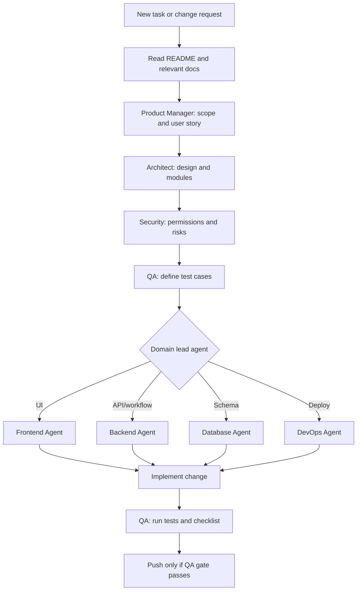

# PRIME v2 Development Flow

Mandatory flow for every change. Do not skip agent consultation steps.

## Step-by-Step

### 1. Understand (no code yet)

- Read [README.md](../../README.md) and affected docs under `docs/`.
- Fill in [TASK-PROMPT-TEMPLATE.md](templates/TASK-PROMPT-TEMPLATE.md).
- Identify user role, workflow status before/after, and permission impact.

### 2. Consult agents (required)

| Step | Agent | Question to answer |
|---|---|---|
| A | Product Manager | Is this in MVP scope? Which user story and acceptance criteria? |
| B | Architect | Which modules change? Any ADR needed? |
| C | Security | Who can access this? Validation and audit requirements? |
| D | QA | What unit, integration, and permission tests are required? |
| E | Domain lead | Frontend / Backend / Database / DevOps — implementation plan |

**Stop** if any agent identifies a blocker (scope creep, missing approval doc, security gap).

### 3. Implement

- Match existing conventions; minimal focused diff.
- Centralize permission and workflow rules (no duplicated business logic).
- Never overwrite submitted proposal versions; never expose private RTEC comments.
- Update docs listed in the task template.

### 4. Verify (before commit)

- Run tests defined in step 2D.
- Self-check against acceptance criteria.
- Confirm no secrets in diff.

### 5. Push (QA gate)

Complete [QA-PUSH-GATE.md](QA-PUSH-GATE.md) before `git push`.

## Phase 0 Reminder

Coding must not begin until MVP, workflow, permissions, and architecture are approved ([README §2](../../README.md)). Agent consultation still applies to documentation and planning work.

**Intern:** use [INTERN-VIBE-CODING-GUIDE.md](INTERN-VIBE-CODING-GUIDE.md) for phase-by-phase Cursor prompts. Phase validation: [PHASES-REFERENCE.md](PHASES-REFERENCE.md).
