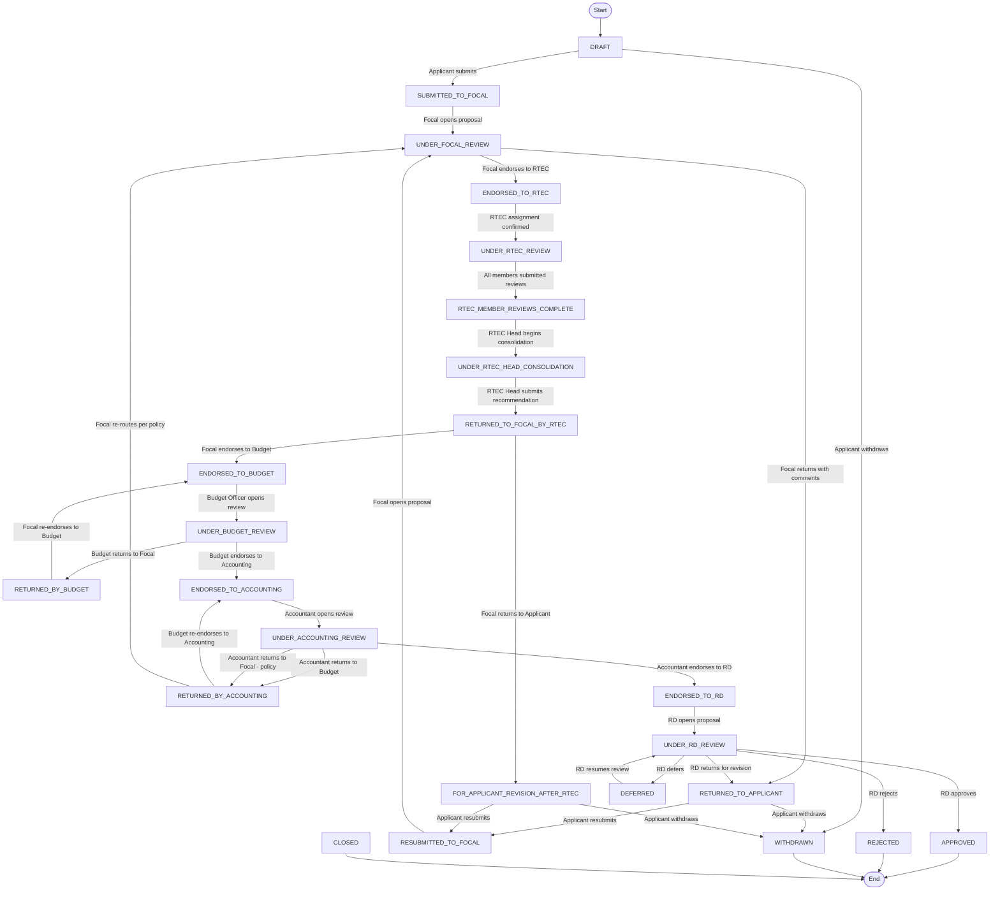

# PRIME v2 — Workflow and Proposal Statuses

| Field | Value |
|---|---|
| Document | PRIME v2 Workflow and Proposal Statuses |
| Version | 1.0 |
| Status | DRAFT |
| Phase | Phase 2 — MVP, Roles, and User Stories |
| Author | Product Manager Agent |
| Date | 2026-06-30 |

---

## Approval

| Approver | Role | Approval Date | Status |
|---|---|---|---|
| [TBC] | Process Owner | — | Pending |

> **Gate rule:** No workflow engine or status-transition implementation may begin until this document is approved by the Process Owner.

---

## 1. Status List with Definitions

| # | Status Code | Definition |
|---|---|---|
| 1 | `DRAFT` | Proposal created by the Applicant and not yet submitted. Editable by the Applicant. |
| 2 | `SUBMITTED_TO_FOCAL` | Applicant has submitted the proposal. System has locked the submitted version and routed it to the assigned Project Focal. |
| 3 | `UNDER_FOCAL_REVIEW` | Project Focal has opened the proposal and is performing the completeness and substantive review. |
| 4 | `RETURNED_TO_APPLICANT` | Project Focal has returned the proposal with official comments. Applicant must revise and resubmit. |
| 5 | `RESUBMITTED_TO_FOCAL` | Applicant has resubmitted the revised proposal. A new version has been created. Project Focal must re-review. |
| 6 | `ENDORSED_TO_RTEC` | Project Focal has determined the proposal is ready for technical evaluation and forwarded it to the assigned RTEC group. |
| 7 | `UNDER_RTEC_REVIEW` | The proposal has been distributed to assigned RTEC members for individual independent review. |
| 8 | `RTEC_MEMBER_REVIEWS_COMPLETE` | All assigned RTEC members have submitted their individual reviews. The RTEC Head may now consolidate. |
| 9 | `UNDER_RTEC_HEAD_CONSOLIDATION` | RTEC Head is actively consolidating member reviews into an official assessment. |
| 10 | `RETURNED_TO_FOCAL_BY_RTEC` | RTEC Head has submitted the official RTEC recommendation. Result returned to Project Focal for next action. |
| 11 | `FOR_APPLICANT_REVISION_AFTER_RTEC` | Project Focal has decided the proposal needs revision based on RTEC findings. Returned to Applicant. |
| 12 | `ENDORSED_TO_BUDGET` | Project Focal has endorsed the proposal to the Budget Officer for financial review. |
| 13 | `UNDER_BUDGET_REVIEW` | Budget Officer is reviewing line-item budgets, cost computations, and financial compliance. |
| 14 | `RETURNED_BY_BUDGET` | Budget Officer has returned the proposal to the Project Focal with budget findings. |
| 15 | `ENDORSED_TO_ACCOUNTING` | Budget Officer has endorsed the proposal to the Accountant for accounting review. |
| 16 | `UNDER_ACCOUNTING_REVIEW` | Accountant is reviewing financial classifications and required financial attachments. |
| 17 | `RETURNED_BY_ACCOUNTING` | Accountant has returned the proposal to Budget or Project Focal with accounting findings. |
| 18 | `ENDORSED_TO_RD` | Accountant has endorsed the proposal to the Regional Director for final decision. |
| 19 | `UNDER_RD_REVIEW` | Regional Director is reviewing the complete proposal, official recommendations, and workflow history. |
| 20 | `APPROVED` | Regional Director has issued final approval. No further action required. |
| 21 | `DEFERRED` | Regional Director has deferred the decision pending additional information or conditions. |
| 22 | `REJECTED` | Regional Director has rejected the proposal. Final negative decision. |
| 23 | `WITHDRAWN` | Applicant has voluntarily withdrawn the proposal before final approval, subject to policy. |
| 24 | `CLOSED` | Proposal closed by Admin due to process resolution, policy action, or system maintenance. |

---

## 2. Allowed Transitions Diagram

---

## 3. Transition Table — Who Can Trigger Each Transition

| From Status | To Status | Actor | Trigger Action | Required Conditions |
|---|---|---|---|---|
| `DRAFT` | `SUBMITTED_TO_FOCAL` | Applicant | Submit proposal | All required fields complete; at least one form section submitted |
| `DRAFT` | `WITHDRAWN` | Applicant | Withdraw | Policy allows withdrawal in this status |
| `SUBMITTED_TO_FOCAL` | `UNDER_FOCAL_REVIEW` | Project Focal | Open/acknowledge proposal | Focal assigned to the proposal's program |
| `UNDER_FOCAL_REVIEW` | `RETURNED_TO_APPLICANT` | Project Focal | Return with comments | At least one official comment required |
| `UNDER_FOCAL_REVIEW` | `ENDORSED_TO_RTEC` | Project Focal | Endorse to RTEC | RTEC group assigned; endorsement comment optional |
| `RETURNED_TO_APPLICANT` | `RESUBMITTED_TO_FOCAL` | Applicant | Resubmit | System creates a new version; previous version locked |
| `RETURNED_TO_APPLICANT` | `WITHDRAWN` | Applicant | Withdraw | Policy allows withdrawal |
| `RESUBMITTED_TO_FOCAL` | `UNDER_FOCAL_REVIEW` | Project Focal | Open proposal | Focal acknowledged the resubmission |
| `ENDORSED_TO_RTEC` | `UNDER_RTEC_REVIEW` | System / Admin | Assignment confirmed | RTEC members notified |
| `UNDER_RTEC_REVIEW` | `RTEC_MEMBER_REVIEWS_COMPLETE` | System | All members submitted | All assigned RTEC members have submitted a final (non-draft) review |
| `RTEC_MEMBER_REVIEWS_COMPLETE` | `UNDER_RTEC_HEAD_CONSOLIDATION` | RTEC Head | Begin consolidation | RTEC Head acknowledged; all member reviews visible |
| `UNDER_RTEC_HEAD_CONSOLIDATION` | `RETURNED_TO_FOCAL_BY_RTEC` | RTEC Head | Submit RTEC recommendation | Official consolidated recommendation written |
| `RETURNED_TO_FOCAL_BY_RTEC` | `FOR_APPLICANT_REVISION_AFTER_RTEC` | Project Focal | Return to Applicant | Official comment or RTEC finding included |
| `RETURNED_TO_FOCAL_BY_RTEC` | `ENDORSED_TO_BUDGET` | Project Focal | Endorse to Budget | RTEC result received; Budget Officer assigned |
| `FOR_APPLICANT_REVISION_AFTER_RTEC` | `RESUBMITTED_TO_FOCAL` | Applicant | Resubmit | New version created |
| `FOR_APPLICANT_REVISION_AFTER_RTEC` | `WITHDRAWN` | Applicant | Withdraw | Policy allows withdrawal |
| `ENDORSED_TO_BUDGET` | `UNDER_BUDGET_REVIEW` | Budget Officer | Open for review | Budget Officer assigned to this proposal type or program |
| `UNDER_BUDGET_REVIEW` | `RETURNED_BY_BUDGET` | Budget Officer | Return to Focal | Budget findings recorded |
| `UNDER_BUDGET_REVIEW` | `ENDORSED_TO_ACCOUNTING` | Budget Officer | Endorse to Accounting | Budget compliance confirmed |
| `RETURNED_BY_BUDGET` | `ENDORSED_TO_BUDGET` | Project Focal | Re-endorse to Budget | Focal has addressed budget concerns |
| `ENDORSED_TO_ACCOUNTING` | `UNDER_ACCOUNTING_REVIEW` | Accountant | Open for review | Accountant assigned |
| `UNDER_ACCOUNTING_REVIEW` | `RETURNED_BY_ACCOUNTING` | Accountant | Return to Budget or Focal | Accounting findings recorded; return destination per policy |
| `UNDER_ACCOUNTING_REVIEW` | `ENDORSED_TO_RD` | Accountant | Endorse to RD | Accounting compliance confirmed |
| `RETURNED_BY_ACCOUNTING` | `ENDORSED_TO_ACCOUNTING` | Budget Officer | Re-endorse to Accounting | Budget addressed accounting concerns |
| `RETURNED_BY_ACCOUNTING` | `UNDER_FOCAL_REVIEW` | Project Focal | Re-route per policy | Policy permits Focal re-routing |
| `ENDORSED_TO_RD` | `UNDER_RD_REVIEW` | Regional Director | Open proposal | RD assigned |
| `UNDER_RD_REVIEW` | `APPROVED` | Regional Director | Approve | Final comment and signature-equivalent action recorded |
| `UNDER_RD_REVIEW` | `DEFERRED` | Regional Director | Defer | Deferral reason recorded |
| `UNDER_RD_REVIEW` | `REJECTED` | Regional Director | Reject | Rejection reason recorded |
| `UNDER_RD_REVIEW` | `RETURNED_TO_APPLICANT` | Regional Director | Return for revision | Comments provided |
| `DEFERRED` | `UNDER_RD_REVIEW` | Regional Director | Resume review | Deferral condition resolved |
| Any (pre-final) | `CLOSED` | Admin | Administrative close | Admin documents reason; cannot close an approved proposal without policy approval |

---

## 4. Audit Requirements for Every Transition

Every status transition must record:

| Field | Description |
|---|---|
| Proposal ID | Identifier of the proposal |
| Previous Status | The status before the transition |
| New Status | The status after the transition |
| Actor User ID | The ID of the user who triggered the transition |
| Role Used | The specific role the actor used (relevant when multi-role) |
| Timestamp | Date and time in UTC ISO 8601 format |
| Comment | The official comment submitted with the action (if any) |
| Workflow Action | The named action (e.g., `ENDORSE_TO_RTEC`, `RETURN_TO_APPLICANT`) |
| Proposal Version | The version number at the time of the transition |
| Session Reference | Session ID or request IP where technically available |

---

## 5. Revision History

| Version | Summary | Author | Date |
|---|---|---|---|
| 1.0 | Initial draft — Phase 2 | Product Manager Agent | 2026-06-30 |
